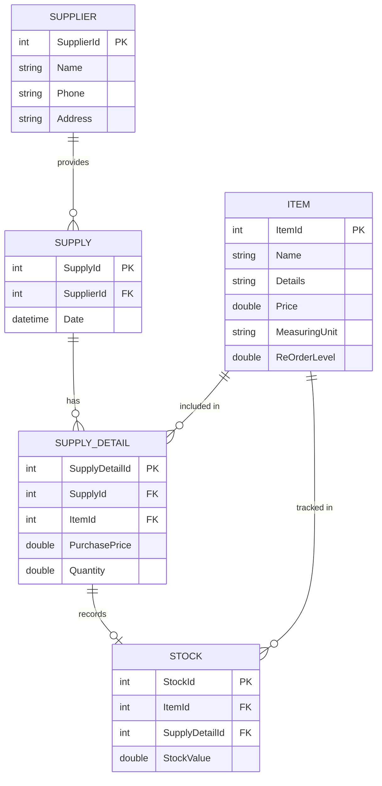

# Entity Relationship Diagram (ERD) – Inventory Management System

## What is an Entity Relationship Diagram?

An **Entity Relationship Diagram (ERD)** is a visual blueprint of a database. It maps out the **entities** (tables) in a system, their **attributes** (columns/fields), and the **relationships** between them — showing how data is connected and structured.

ERDs are used to:
- Plan and design a database schema before writing code
- Communicate the data model clearly to developers and stakeholders
- Document how different parts of the system relate to one another
- Identify primary keys (PK), foreign keys (FK), and cardinality (one-to-one, one-to-many, etc.)

### Key ERD Concepts

| Concept | Description |
|---|---|
| **Entity** | A table/object representing real-world data (e.g., `Item`, `Supplier`) |
| **Attribute** | A field/column of an entity (e.g., `Name`, `Price`) |
| **Primary Key (PK)** | A unique identifier for each record in a table |
| **Foreign Key (FK)** | A field that links one table to the primary key of another |
| **Relationship** | How two entities are associated (1:1, 1:N, M:N) |
| **Cardinality** | The count of how many records on each side of a relationship |

---

## ERD: Inventory Management System

The system uses **Entity Framework (Code-First)** with 5 entities registered in `InventoryDBContext`, all with cascade delete disabled for referential integrity.

### Mermaid Diagram

---

## Entities & Attributes

### 1. `Item`
Represents a product tracked in the inventory.

| Field | Type | Constraint |
|---|---|---|
| ItemId | int | PK |
| Name | string | Required, Max 50 chars |
| Details | string | Max 300 chars |
| Price | double | — |
| MeasuringUnit | string | — |
| ReOrderLevel | double | Default: 10 |

### 2. `Supplier`
Represents a vendor who supplies items.

| Field | Type | Constraint |
|---|---|---|
| SupplierId | int | PK |
| Name | string | Required, Max 20 chars |
| Phone | string | — |
| Address | string | — |

### 3. `Supply`
Represents a supply transaction (a delivery from a supplier).

| Field | Type | Constraint |
|---|---|---|
| SupplyId | int | PK |
| SupplierId | int | FK → Supplier |
| Date | datetime | — |

### 4. `SupplyDetail`
A line item within a supply transaction — which item was supplied, at what price, and in what quantity.

| Field | Type | Constraint |
|---|---|---|
| SupplyDetailId | int | PK |
| SupplyId | int | FK → Supply |
| ItemId | int | FK → Item |
| PurchasePrice | double | Required |
| Quantity | double | Required |

### 5. `Stock`
Tracks the current stock level of an item, derived from a specific supply detail entry.

| Field | Type | Constraint |
|---|---|---|
| StockId | int | PK |
| ItemId | int | FK → Item |
| SupplyDetailId | int | FK → SupplyDetail |
| StockValue | double | Required |

---

## Relationships

| Relationship | Type | Description |
|---|---|---|
| SUPPLIER → SUPPLY | One-to-Many | One supplier can make many supply deliveries |
| SUPPLY → SUPPLY_DETAIL | One-to-Many | One supply transaction has many line items |
| ITEM → SUPPLY_DETAIL | One-to-Many | One item can appear across many supply details |
| ITEM → STOCK | One-to-Many | One item has many stock records over time |
| SUPPLY_DETAIL → STOCK | One-to-One | Each supply detail line generates one stock record |

---

## DbContext Configuration

All relationships are configured in `InventoryDBContext.OnModelCreating()` using the **Fluent API**:
- `HasRequired(...).WithMany().HasForeignKey(...)` is used for all FK configurations
- `WillCascadeOnDelete(false)` is set on all relationships to prevent accidental cascading deletes

---

*Generated for the Inventory Management System — Final Semester Project (WPF / C# / Entity Framework)*
